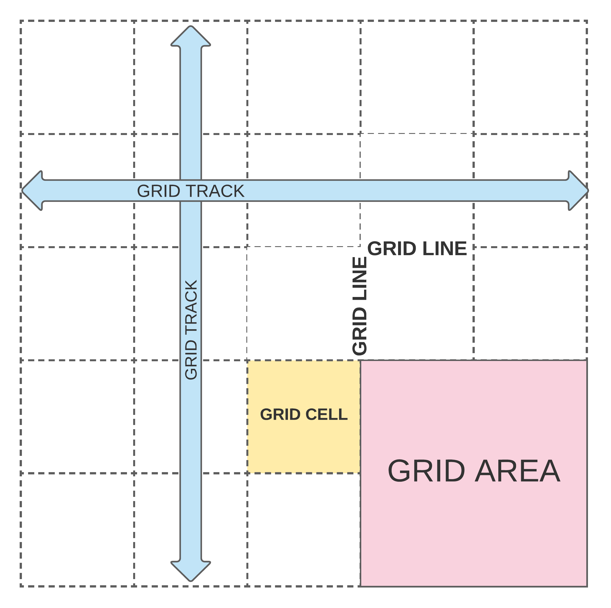

 __SOFTWARE ENGINEERING IMMERSIVE__

# CSS Grid

## Objectives

By the end of this lesson students will be able to:

- [ ] Explain when to use Flexbox vs. Grid
- [ ] Use proper terminology to refer to the different grid pieces
- [ ] Create layouts using CSS Grid

## The Concept Of Grid

Although __CSS Grid__ wasn't available until 2017 the concept of __grid__ isn't new. [Bootstrap](https://getbootstrap.com/docs/4.1/layout/grid/) was built on arranging content in rows and columns, essentially creating a grid.

### What is CSS Grid?

So far we've been using __CSS Flexbox__ to arrange content. It's very powerful and something we will continue to work with even with the introduction of Grid. It is however only `one-dimensional`.


CSS Grid Layout is a __two-dimensional layout__ system (which means it includes both columns and rows).


Both __Flexbox__ and __Grid__ almost always work together, with __Grid__ being applied to the overall layout and __Flexbox__ to the content.


Let's take a few minutes to explore this [web app](https://www.inprnt.com/discover/) built with Grid layout.

> This site was built by a former GA student using CSS-Grid layout, Flexbox, and React.

### Basic Terminology

Here are some of the terms we will need to understand when working with CSS Grid.

- __Grid container__ - An element that defines a grid-formatting context for its contents.
- __Grid item__ - Each child element of a grid container.
- __Grid track__ - A continuous run between two adjacent grid lines. A grid row or column.
- __Grid cell__ - Any 1x1 space bounded by four grid lines, with no grid lines running through it.
- __Grid area__ - Any rectangular area bounded by four grid lines and made up of one or more grid cells.



## Working With CSS Grid: Columns and Rows

Grid is the most robust layout system in CSS. You utilize Grid by applying CSS rules to both the parent (container) and its children (items), much like we did with Flexbox.

During the lecture we will reference [A Complete Guide to Grid](https://css-tricks.com/snippets/css/complete-guide-grid/) as our go to guide so let's spend a few minutes taking a look at the docs before moving on.

### Implementation: Holy Grail Layout

One of the most common layouts for web design and development is known as the Holy Grail:


There are a few ways to implement __Grid__. We will focus on the following:

1. To start, you must have a __container__ (or __parent__) element, with at least one __nested__ (or __child__) elements inside.

```html
<div class="parent">
  <div class="child" id="one">1</div>
  <div class="child" id="two">2</div>
  <div class="child" id="three">3</div>
  <div class="child" id="four">4</div>
  <div class="child" id="five">5</div>
</div>
```

2. On the container, specify that you are using `display: grid` and what your ___template___ will look like - more specifically, your ___rows___ and ___columns___. Here's an example.

```css
.parent {
  display: grid;
  grid-template-rows: 100px 600px 100px;
  grid-template-columns: 1fr 3fr 1fr;
}
```

In the above example, `fr` represents a `fraction`— a unit that will evenly span the remainder of the space.

Here we have specified ___3 rows___, taking up 100, 600, and 100 pixels respectively. We also specified ___3 columns___, giving us a total of ___9 cells___. `grid-template` also takes other units like `%`, `rem`, and `auto`. For now we will focus on `px` and `fr` units. You can also use `repeat` to specify multiple rows or columns of one size, such as `repeat(5, 1fr)`

3. the _child_ elements, you can specify _where_ the _cells_ are located and the _size_ you want them to be. You can either use the starting and ending points (such as in the `grid-column` example), or use `span` to indicate size after a starting point (such as in the `grid-row`)

```css
selector {
  grid-column: where-to-start / where-to-end;
  grid-row: where-to-start / span size;
}
```

We can use this syntax on a __child__ element to declare the area it should cover! Let's use our header from the Holy Grail layout as an example:

```css
#one {
  grid-column: 1 / 4;
  grid-row: 1 / span 1;
}
```

This element takes up 1 row, starting at row 1, and takes up 3 columns, starting at column 1.

We could also write `grid-row: 1;` for short, if your element only spans 1 row.

> This also works for `grid-column`.

### Exercise: Layout With Columns + Rows

Let's create the holy grail layout above! In `src/App.css`, add the styles for `#two` through `five`, so that `.parent` matches the layout above.

## Grid Template Areas

Are numbers not your thing? Are you more of a visual thinker? Then you will love `grid-template-areas`. Let's go through the Holy Grail Layout again, this time using grid areas to set up our grid.

1. We can use the same HTML as before because we have our parent and children all set up!

```html
<div class="parent">
  <div class="child" id="one">1</div>
  <div class="child" id="two">2</div>
  <div class="child" id="three">3</div>
  <div class="child" id="four">4</div>
  <div class="child" id="five">5</div>
</div>
```

2. On the container, we again specify that you are using `display: grid` and what your ___template___ will look like. However, this time we will use a more visual approach with `grid-template-area` Grid template area can take 3 possible values:

    1. `grid-area-name`: the name of a grid area specified with grid-area
    2. `.`: a period which signifies an empty grid cell
    3. `none`: meaning no grid areas are defined

```css
.parent {
  display: grid;
  grid-template-areas:
    "H H H H"
    "L A A R"
    "F F F F";
}
```

3. Now our page knows we want 4 columns, but how do we get the areas where we want them? We specify which grid area we want each child element to belong to, and Grid will take care of the rest.

```css
#one {
  grid-area: H;
}

#two {
  grid-area: L;
}

#three {
  grid-area: A;
}

#four {
  grid-area: R;
}

#five {
  grid-area: F;
}
```

We can still use `grid-template-rows` and `grid-template-column` to set specific heights and widths for our rows and columns.

## Great Resources:

- [CSS Tricks - A Complete Guide to Grid](https://css-tricks.com/snippets/css/complete-guide-grid/)
- [Grid Garden](https://cssgridgarden.com/)
- [Css Grid - Scrimba](https://scrimba.com/learn/R8PTE)
